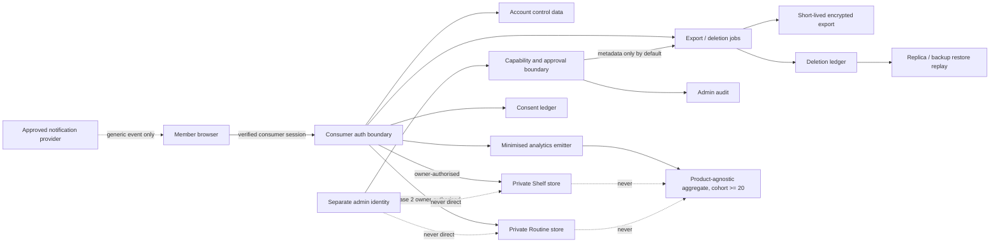

# Member Privacy and Data-Lifecycle Foundation

> **Status:** Foundation architecture packet for human review. It is not legal advice, a DPIA, a processor approval, a production-readiness approval, or authority to collect or migrate member data.
>
> **Blocking rule:** **No member migration or production member-data collection is authorised until Gate G0 records the full name, capacity, decision, date, and evidence link of a qualified Nigerian Privacy/legal approver, and every other blocking G0 item is `pass`.** The Privacy/legal approver is currently **UNASSIGNED**. AI analysis cannot fill or approve that gate.
>
> **Implementation state (2026-08-02):** Architecture only. No member store, consumer-auth journey, Shelf/Routine route, or member UI is represented as implemented.

This packet turns [ADR 0012](../adr/0012-private-member-shelf-and-routine-portal.md) into the bounded data-administration contract that must precede the later platform-delivery and migration work. It preserves the independent operator-auth boundary in [ADR 0007](../adr/0007-internal-moderation-operations-console.md).

## 1. Authority, scope, and non-decisions

This packet defines required separations, ownership rules, lifecycle behaviour, review evidence, and release gates. It does not:

- select a Nigerian statutory legal basis, classify Shelf/Routine data as sensitive or non-sensitive, determine an NDPC registration category, or approve a cross-border transfer;
- approve a processor, subprocessor, region, DPA, transfer instrument, retention add-on, or production email provider;
- implement SQL, member tables, authentication, routes, APIs, components, analytics, notification delivery, or administrative tooling;
- merge consumer identity with operator identity, make private data visible to catalogue or community systems, or turn analytics into a profile;
- authorise a migration, staff alpha, beta, public release, or any production collection.

Those decisions require the named human signatures in section 13. Any conflict is resolved in favour of ADR 0012 and the stricter privacy boundary until an accepted ADR changes it.

## 2. Official-source review frame

The following is a review frame, not a legal conclusion. A qualified Nigerian Privacy/legal approver must record the actual applicability and interpretation before Gate G0:

- The official [Nigeria Data Protection Act 2023](https://ndpc.gov.ng/wp-content/uploads/2024/03/Nigeria_Data_Protection_Act_2023.pdf) addresses fair, lawful and transparent processing, purpose limitation, minimisation, retention, security and accountability (section 24); lawful bases (section 25); consent (section 26); notices (section 27); DPIAs (section 28); processors (section 29); data-subject rights (sections 34–38); security and breach handling (sections 39–40); and cross-border transfers (sections 41–43).
- The NDPC's [General Application and Implementation Directive 2025](https://ndpc.gov.ng/wp-content/uploads/2025/07/NDP-ACT-GAID-2025-MARCH-20TH.pdf) adds current implementation guidance, including registration categorisation, DPIA triggers and filing, privacy by design/default, processor agreements, breach records, rights handling, and cross-border review. Whether JeloCare is a data controller or processor of major importance, and its category, remains a human regulatory/legal determination.
- The official [Federal Competition and Consumer Protection Act 2018](https://fccpc.gov.ng/wp-content/uploads/2022/07/FCCPA-2018.pdf) informs the human review of clear, understandable consumer notices and fair, non-misleading account cancellation or deletion representations. The precise duties and wording require counsel approval.

Open legal decisions are therefore not converted into assumed consent. In particular, Privacy/legal must decide and document: the lawful basis for every purpose; whether any field or inference is sensitive data; the appropriate DPIA and NDPC filing/consultation path; controller-of-major-importance registration; transfer basis and adequacy; notice and rights language; direct-marketing boundaries; legal-hold authority; and any consumer-protection implications.

## 3. Six data classes and strict separation

| ADR 0012 class | Permitted contents | Required boundary | Forbidden coupling |
|---|---|---|---|
| **Account** | Internal member identifier, verified auth subject, minimal profile/status, lifecycle timestamps | Consumer identity only; independent of operator authentication | Operator roles, Shelf/Routine contents, public-story consent, analytics profile |
| **Private Shelf** | Member-owned saved catalogue product references and member-controlled lifecycle metadata | Private row ownership; server-side authorisation on every operation | Community visibility, operator browsing, notification payloads, retailer/contact data |
| **Private Routine** | Member-owned routine and ordered catalogue-linked steps | Separate from Shelf and gated to ADR 0012 Phase 2 | Medical diagnosis/treatment claims, public story, operator browsing, analytics contents |
| **Consent** | Append-only notice/purpose/version/choice evidence and withdrawal | Purpose-specific ledger; consent is not a generic account flag | Treating silence as consent, retroactive notice mutation, bundled unrelated purposes |
| **Notification endpoint** | Minimal provider handle/status and notification purpose | Optional, independently revocable and provider-scoped | Shelf/Routine contents, account recovery secrets, public-community contact reuse |
| **Public story/community** | Existing explicit-publication submission and moderation records | Existing community consent and moderation lifecycle remains independent | Becoming member content automatically, exposing a member account, Shelf or Routine |

Supporting control records—sessions, export/deletion jobs, deletion tombstones, admin capability/audit events, security events and privacy-safe analytics—are not a seventh content bucket. Each has a narrow operational purpose, independent access rule and explicit lifecycle below. There is no general-purpose member blob.

Additional invariants:

1. A consumer session can never confer operator, privacy-admin, security-admin, or moderation privileges.
2. An operator session can never become a member session or browse private content. If one human has both relationships, each identity, credential, session and audit trail remains separate.
3. Public catalogue pages consume published catalogue truth only. Private Shelf/Routine rows may reference catalogue identifiers but cannot overwrite catalogue truth.
4. Notifications carry generic event copy or opaque deep links only—never product names, routines, OTP values, session tokens, or private contents in provider-visible metadata.
5. Product-agnostic analytics never contains product identifiers, Shelf/Routine contents, email/phone, auth subject, free text, precise timestamps tied to a person, or a stable cross-purpose member profile.

## 4. Purpose, lifecycle, and access matrix

`UNDECIDED` means a blocking human decision; it is not permission to process.

| Record | Purpose / minimum fields | Source | Permitted recipients | Legal-basis review | Maximum retention and deletion | Access contract |
|---|---|---|---|---|---|---|
| Account | `member_id`, verified `auth_subject_id`, status, created/closed timestamps; optional display field only if justified | Consumer auth result; member | Member; narrowly authorised account service | **UNDECIDED:** contract/legitimate-interest/other analysis; notice and sensitive-data classification | Active while account exists; immediate write lock/session revocation at close; 7-day cancellation; primary deletion by day 30 | Owner and account service; support sees status only, not private contents |
| Shelf | `item_id`, `owner_member_id`, catalogue product reference, saved/removed timestamps | Authenticated member | Member; Shelf service | **UNDECIDED:** necessity and basis per purpose | Active while saved; removed row inaccessible immediately and purged from primary within 30 days; replica within 24h; backup expiry within 35d | Owner-only by subject-to-owner binding; no operator content read |
| Routine | `routine_id`, owner, title constrained to approved data policy, ordered catalogue-linked steps, lifecycle timestamps | Authenticated member | Member; Routine service after Phase 2 gate | **UNDECIDED:** separate DPIA/purpose and sensitive-data classification | Same active/close lifecycle as Shelf; removed content primary purge within 30 days | Owner-only; Phase 2 feature gate; no Shelf entitlement inference |
| Consent event | Member, purpose, notice/policy version, affirmative choice/withdrawal, time, capture channel, evidence integrity metadata | Member action; approved administrative correction as a new event only | Member; privacy service; case-scoped auditor | Consent only where Privacy/legal approves it; other bases still require notice | 24 months after account close unless a shorter approved rule applies; never overwrite history | Append-only; member can view; privacy admin sees evidence metadata, not private contents |
| Notification endpoint | Member, provider-scoped opaque handle, channel/purpose, verified/revoked state, timestamps | Member and approved provider callback | Member; notification service; approved provider | **UNDECIDED:** optional consent and communications rules | Until revoked/account closed, then provider and primary deletion within 30 days; provider proof required | Notification service only; separate from recovery channel and community contacts |
| Public story/community | Existing submission, explicit publication choice, moderation state | Contributor under existing community flow | Existing moderation/publication recipients only | Existing flow requires its own approved basis/notice; membership does not change it | Existing approved community lifecycle; not inherited from member closure without human policy | Existing moderation operators; never a member-admin capability |
| Provider session / local revocation record | Opaque session identifier/hash, member, issued/rotated/revoked/expiry time, risk reason code | Auth provider; security service | Auth/security services; member session list | **UNDECIDED:** security necessity/basis | Provider session to approved short lifetime; security audit event maximum 90 days | No bearer token at rest or in logs; owner can revoke own sessions; security-admin metadata only |
| Export job/artifact | Member, scope/version, state, timestamps, checksum, expiry; encrypted artifact | Authenticated member request; member stores | Requesting member via fresh authorisation; export worker | Rights/legal-obligation analysis by Privacy/legal | Complete within 24h target; artifact expires and is purged within 24h | Single-use or bounded download; no support download; access audited |
| Deletion/cancellation job | Member, state, deadlines, retry/error code, cancellation time, provider work items | Authenticated member; approved case process | Member; deletion worker; privacy admin metadata | Rights/legal-obligation and cancellation wording review | Job metadata only as long as needed for completion/evidence; content deleted to ADR maxima | Member can cancel only during 7-day window after re-auth; worker is idempotent |
| Deletion ledger | Pseudonymous subject/member tombstone, source generation, scope, deletion time, restore-replay status, evidence hash | Deletion worker | Restore/deletion workers; case-scoped privacy admin | **UNDECIDED:** minimum evidence retention and pseudonymous-data treatment | Retention period requires Privacy/legal approval; never contains content, contact data or auth token | Stored outside the restored data boundary; append-only, integrity protected |
| Admin capability/audit | Separate operator identity, capability, approval/ticket, action type, target pseudonym, reason, time, outcome | Authorised human and control plane | Security/privacy reviewers; affected-member evidence where required | Security/accountability basis and staff notice review | Admin audit maximum 24 months | Capability service independent of `moderation_operators`; no standing private-content browse |
| Privacy-safe analytics | Random short-lived event ID, coarse route/event category, coarse time, release cohort; no product/member/content fields | Client/server after approved minimisation | Product analytics role; aggregate reports | **UNDECIDED:** necessity, notice, opt-out/consent assessment | Raw pseudonymous events maximum 30 days; aggregates maximum 13 months and only where cohort ≥20 | Separate analytics store/secret; no joins to member, Shelf, Routine, notification or community |
| Legal-hold record | Case ID, scope, authority, approver, start/review/expiry, affected pseudonymous IDs | Named Privacy/legal approver | Privacy/legal and case-scoped worker only | **UNDECIDED:** documented legal authority required for each hold | Case-specific; expires unless affirmatively renewed | Cannot enable application reads; suppresses only the precisely authorised purge step |

Any implemented retention shorter than these maxima is preferred. Provider defaults are not retention policy. A legal hold never silently converts a missed purge into compliance.

## 5. End-to-end data-flow map



| Flow | Required sequence | Privacy/security boundary and evidence |
|---|---|---|
| **F1 Enrollment** | Member requests OTP → uniform response → approved mail provider delivers OTP → consumer auth verifies → rotate session → create minimal account → present versioned notices/choices → append consent events | Do not reveal account existence. Separate transactional authentication from optional notifications. Record provider, notice version and affirmative choices, but never OTP or private content. Enrollment switch remains off until G0. |
| **F2 Shelf save** | Authenticated request → derive subject server-side → resolve account → validate published catalogue reference → authorise owner → write idempotently → emit coarse success metric | Never accept `owner_member_id` from the client as authority. No product identifier or member identifier in analytics/logs. |
| **F3 Shelf read** | Fresh/valid session → derive subject → owner-filtered query → return only that member's rows and current public catalogue presentation | Default deny on missing/ambiguous ownership. Cache is private/no-store and never shared/CDN cached. No operator path. |
| **F4 Shelf remove** | Re-auth where risk requires → mark immediately inaccessible → enqueue idempotent purge → primary purge by day 30 → replica purge within 24h of primary change → deletion ledger covers backup restore | UI disappearance is not evidence of deletion. Completion evidence contains counts/checksums and deadlines, not contents. |
| **F5 Routine** | Repeat F2–F4 with a distinct store, policy and Phase 2 flag only after all ADR 0012 Routine entry criteria pass | Shelf access never implies Routine enablement. A 28-day stable Shelf release and other ADR thresholds are mandatory before Phase 2. |
| **F6 Recovery / session revocation** | Uniform recovery request → OTP through approved provider → bound one-time verification → rotate all relevant credentials → revoke chosen/all sessions → append security event | Prevent fixation/replay and never log codes, tokens or email. Recovery cannot bridge to operator auth. Member sees active sessions and revocation outcome. |
| **F7 Export** | Authenticated request + step-up → immutable scope snapshot → queued job → encrypted JSON artifact → fresh-authorised, bounded download → artifact purge within 24h | Export includes the member's account, consent, Shelf/Routine and relevant lifecycle evidence in an approved schema; excludes other members, internal secrets and unrelated operator data. Alert on retries, unusual volume and scraping. |
| **F8 Deletion / cancellation** | Authenticated close request + step-up → immediate write lock and session revoke → 7-day cancellation window → irreversible primary deletion by day 30 → approved provider credential/endpoint deletion → replica/backup workflow → signed completion | Cancellation uses fresh/re-verified consumer auth. After the window, no restore-to-service. If the same provider subject has an independent operator relationship, delete member data while preserving only the separately justified operator credential and disclose the exception. |
| **F9 Replica / backup purge** | Primary deletion emits tombstone → replicas apply within 24h → rolling backups expire within 35d → any restore is isolated → replay deletion ledger/removals → verify → human release | Restored data is never served before replay. Provider recovery/history configuration must be evidenced; a plan default is not proof. |
| **F10 Administrative access** | Separate operator auth → capability check → ticket/approval → time-bound action → immutable audit → expiry/review | `member_support`: account/job status only. `privacy_admin`: export/deletion reconciliation only. `security_admin`: case-scoped reveal only with ticket + Privacy approval, ≤60 minutes. No routine content browsing. |
| **F11 Product-agnostic analytics** | Approved event allowlist → strip identifiers/content → coarse time/category → short-lived random ID → raw purge ≤30d → aggregate only at cohort ≥20 → aggregate purge ≤13m | No joins to member stores or stable profile, no product/Shelf/Routine fields, no ad targeting, no replay/session recording. Analytics failure must not block privacy rights. |

## 6. Processor, region, transfer, and secret inventory

“Actual” means evidenced in the repository or linked project configuration; it does **not** mean approved for member data. “Proposed” means ADR 0012 design intent and remains disabled pending review.

| Service | Current evidenced use / proposed member use | Region and cross-border question | Data boundary | Blocking evidence/decision |
|---|---|---|---|---|
| **Vercel** | Actual public web/runtime. Linked project reports function region `iad1` (Washington, D.C.). Proposed member API/runtime, not implemented. | Processing would leave Nigeria for the US. Vercel says default processing is in the US and may involve global transfers in its [compliance documentation](https://vercel.com/docs/security/compliance); function regions are configurable per [region documentation](https://vercel.com/docs/functions/configuring-functions/region). | Server secrets only. Runtime/log payloads must exclude private contents, auth headers, cookies, OTPs and direct identifiers. | Confirm plan, contracting entity, executed [Vercel DPA](https://vercel.com/legal/dpa), current subprocessors, chosen regions, log plan/retention and approved transfer mechanism. [Runtime log retention](https://vercel.com/docs/logs/runtime) is plan-dependent; the actual plan/add-on and retention are **UNKNOWN** and DPA applicability must not be assumed. |
| **Neon / Neon Auth** | Actual PostgreSQL integration and auth client configuration; no member production store is evidenced. Project reports AWS `us-east-1` and six-hour history retention. Proposed account/private/control stores and consumer auth. | US cross-border processing. [Neon subprocessors](https://neon.com/subprocessors) and the official [Neon DPA](https://neon.com/pdf/DPA.pdf) must be reviewed against the actual contract. Neon Auth keeps identity/session data with the database and can branch it, per [Neon Auth architecture](https://neon.com/blog/neon-auth-branchable-identity-in-your-database). | Database credentials server-only; public auth base/client values are identifiers, not secrets. Production member/auth data must never be cloned into preview/development; those environments use synthetic/schema-only data and independent invalid credentials. | Confirm contract/DPA, transfer mechanism, subprocessor list, production/preview branch policy, deletion APIs, Auth mail provider, point-in-time recovery/snapshot retention and proof that ADR deletion/restore rules are achievable. Current six-hour history is evidence, not a promised future setting. |
| **Upstash Redis** | Actual Vercel integration shared across production, preview and development; actual database region/topology, ACL, at-rest encryption and backup settings are not established here. Proposed only for anti-abuse/idempotency metadata. | Location and replication are **UNKNOWN**. [Global database documentation](https://upstash.com/docs/redis/features/globaldatabase) describes selectable primary/read regions and asynchronous replication, but does not establish this resource's configuration. | Never store private content, contact data, OTPs, session tokens or raw IP/email. Allow only environment-namespaced, HMAC-pseudonymised counters/idempotency keys with short TTLs. Production should use an independently approved resource/namespace. | Confirm resource/regions, plan, executed [Upstash DPA](https://upstash.com/trust/dpa.pdf), transfer basis, environment isolation, ACL/TLS/at-rest protection, eviction/TTL semantics, backups and deletion proof. Review [security](https://upstash.com/docs/redis/features/security), [durability](https://upstash.com/docs/redis/features/durability), [backup](https://upstash.com/docs/redis/features/backup) and [shared responsibility](https://upstash.com/docs/redis/help/shared-responsibility-model) docs. |
| **Hostinger mail** | Actual server-side retailer transactional-email implementation. It is **not selected or approved** for member OTP, recovery or notification delivery. | Contracting entity, processing locations, subprocessors and transfer path are **UNKNOWN** for this project and purpose. | Existing API token/SMTP credential stays server-only. Any future member provider receives only the minimum destination, approved template and one-time opaque delivery reference. | Privacy/Procurement must review the official [Hostinger DPA](https://www.hostinger.com/legal/dpa), [security policy](https://www.hostinger.com/legal/security-policy), [Mail API](https://api.mail.hostinger.com/) and account contract, then approve or choose another provider. Auth and optional notifications may require separate providers/purposes. |
| **Future analytics/notification provider** | No provider selected or authorised. | **UNKNOWN**; no data may flow while unknown. | Must conform to F11 and notification boundaries; self-hosted does not waive review. | New processor intake, data map, DPA/subprocessors/region/transfer decision, deletion test and Privacy/legal signature before connection. |

The absence of an NDPC adequacy finding in this packet is not evidence for or against adequacy. Privacy/legal must document the section 41–43/GAID transfer route, applicable safeguards, risk assessment and data-subject notice for every cross-border flow.

### Subprocessor evidence snapshot (checked 2026-08-02)

| Primary provider | What is actually evidenced for JeloCare | Current official inventory that must be reviewed | Unknown that blocks member use |
|---|---|---|---|
| Neon | Project platform reports **AWS**, `us-east-1`; AWS is therefore on the evidenced storage path | Neon's [current subprocessor list](https://neon.com/subprocessors) (last updated on-page 2026-04-16) lists Salesforce, Grafana, AWS and Microsoft Azure as potential service subprocessors | Tenant/data-path use of any listed provider other than the evidenced AWS path; support/telemetry access; change-notice subscription and executed contractual list |
| Vercel | Vercel runtime and `iad1` are actual; tenant-specific downstream path is not exposed in repository evidence | Vercel's [Trust Center subprocessor inventory](https://security.vercel.com/) is the current official, changing list referenced by its DPA | Exact subprocessors touching JeloCare request/log/build data, actual plan/retention, transfer locations and notice subscription |
| Upstash | One Redis integration is actual and shared across environments; no region/topology is evidenced | Upstash's official [subprocessor list](https://upstash.com/static/trust/subprocessors.pdf) includes AWS as cloud infrastructure plus corporate/service vendors; the DPA treats the published list as changeable | Actual cloud/region/replica/data-path subset for this Redis resource, backup location, support/log access and list version incorporated into JeloCare's contract |
| Hostinger | Retailer-email API/SMTP use is actual; member delivery is not | Hostinger's DPA permits subprocessors, but a project-specific current subprocessor/location record is not established here | Contracting entity, delivery/storage/support path, subprocessors, retention/deletion and whether any member purpose will use it |

The G0 provider record must snapshot the then-current official lists, identify the subset reasonably expected to process JeloCare member data, record change-notice owners, and obtain qualified Privacy/legal and Procurement decisions. This table must not be used to claim that every corporate vendor on a provider list receives JeloCare data.

### Secret and environment boundary

| Material | Permitted location | Never permitted |
|---|---|---|
| Database connection credentials, auth server secrets, Upstash REST token, mail API token | Approved production secret store; least-privilege server runtime and named break-glass administrators | Client bundle, repository, logs, analytics, support tickets, preview copied from production |
| Session/refresh cookies | Secure, HttpOnly, SameSite policy approved through CSRF review; encrypted transport | JavaScript-readable storage, URLs, logs, notification links |
| OTP/recovery token | Provider and bounded verification service for one use and short expiry | Database analytics, logs, customer support, reusable hashes without a threat review |
| Public auth URL/client identifier | Public configuration only where the provider defines it as non-secret | Treating it as authorisation; combining it with server credentials |
| Deletion-ledger integrity key | Dedicated production secret with version and dual-control rotation | Same restore snapshot as member data; client/runtime logs |

Production, preview, development and local environments require distinct credentials, cookie namespaces, rate-limit namespaces and datasets. Preview must never receive production member/auth rows through database branching, backup restore or environment-variable inheritance.

## 7. Threat model and required controls

All controls below are acceptance requirements for the later implementation, not claims about current code.

| Threat | Required prevention/detection | Required evidence and safe response |
|---|---|---|
| Account **enumeration** | Uniform status/body/timing envelope for enrolment and recovery; pseudonymous rate keys | Black-box tests across known/unknown addresses; alert on distributed probes; disable sends, not public browsing |
| **OTP flooding** / cost abuse | Per-destination, per-network and global quotas; resend cooling; provider budget ceiling; HMAC keys | Load/abuse tests and provider-cost alert; OTP/recovery fails closed with a documented manual privacy-rights route |
| Session **fixation** | Rotate session at verification, recovery and privilege boundary; ignore client-selected session IDs | Session-rotation integration test; revoke affected sessions globally |
| **CSRF** | SameSite/cookie policy plus origin and anti-CSRF controls on state changes; no GET mutation | Cross-origin test suite for save/remove/export/delete/revoke; disable affected writes |
| **IDOR** | Derive member server-side, owner predicate in every query/policy, default deny | Two-member negative tests at service and datastore policy layers; stop all member reads/writes on failure |
| OTP/link/job **replay** | One-time nonces, short expiry, atomic consume, idempotency keys and state machine | Concurrent replay tests; revoke token/session and reconcile jobs |
| **Export scraping** | Step-up auth, single-use/bounded URLs, 24h purge, concurrency/volume limits | Export access audit and anomalous-volume alert; pause new exports while preserving manual rights fulfilment |
| **Deletion abuse** | Step-up, clear 7-day cancellation, re-verification to cancel, irreversible transition, notifications without sensitive detail | State-machine/concurrency tests and signed completion; lock writes immediately; case escalation for coercion/account takeover |
| **Rate-limit outage** | Independent production resource; explicit dependency health; no silent allow-all | Inject outage. Default fail closed for OTP/recovery/export/delete initiation; offer a verified manual rights channel; existing public pages remain available |
| **Logging/cache leakage** | Structured allowlist, redaction at source, `private/no-store`, no shared cache, no request-body/auth logging | Canary tests for cookies/OTP/product/member data in logs and caches; purge accessible copies and start incident process |
| **Admin misuse** | Separate identity/capability registry, least privilege, ticket + approval, just-in-time expiry, immutable audit | Quarterly access review; real-time unapproved-access alert; revoke admin capability without affecting consumer account |
| **Backup resurrection** | External deletion ledger; isolated restore; mandatory replay; no traffic until verification | Restore drill with deleted canaries, signed counts and Privacy/Data Admin release; destroy unsafe restore |
| **Consumer-to-operator privilege path** | Separate credentials, issuers/audiences, sessions, cookie names, stores and middleware; no role claims copied from member data | Automated cross-audience/cookie/token tests; disable both auth bridges if any path appears |
| **Operator-to-consumer privilege path** | Operator capability never satisfies member ownership; support cannot impersonate; assisted recovery creates no session | Negative access/impersonation tests and admin audit review; revoke offending capability/session |
| Cross-environment data escape | Independent secrets/data/namespaces; prohibit production branching into preview; deployment guard | CI/config evidence and seeded canary scan; disable preview and rotate leaked credentials |

## 8. Schema, ownership, and access-policy contract (no SQL)

The later migration may choose names/types, but it must preserve these conceptual entities and invariants:

| Entity | Required conceptual identity/relationship | Row owner / writer | Special invariant |
|---|---|---|---|
| `member_account` | Internal `member_id` ↔ one verified consumer-auth subject; lifecycle status | Account service after auth verification | Auth subject unique; contains no operator role |
| `member_consent_event` | Event ID → member + purpose + notice/version + choice | Member action through consent service | Append-only; corrections/withdrawals are new events |
| `member_shelf_item` | Item ID → owner member + published catalogue product | Owner through Shelf service | Unique active owner/product pair as approved; removal inaccessible immediately |
| `member_routine` / `member_routine_step` | Routine → owner; ordered step → routine + catalogue product | Owner through Phase 2 service | Routine title/content policy approved before collection; cascade never crosses owner |
| `member_notification_endpoint` | Endpoint → owner + provider/purpose | Owner/notification service | Separate from recovery identity; no community reuse |
| `member_export_job` | Job → requesting member + immutable scope/state/deadlines | Owner request; export worker transitions | Worker cannot broaden scope; artifact is separate and expiring |
| `member_deletion_job` | Job → member + cancellation/irreversible states/deadlines | Owner request; deletion worker transitions | One active close flow per account; all steps idempotent |
| `member_deletion_ledger` | Tombstone → pseudonymous subject/member + generation/scope | Deletion/restore service | Outside restored boundary; no private content/contact token |
| `member_security_event` | Event → member pseudonym/session pseudonym + allowlisted code/time | Auth/security services | Maximum 90 days; no raw address, token or private content |
| `member_admin_capability` | Independent operator → capability + scope/expiry/approval | Security control plane | Never derived from `member_account` or `moderation_operators` |
| `member_admin_audit_event` | Action → operator + capability + case + target pseudonym/outcome | Append-only control plane | Maximum 24 months; contents excluded |
| `member_legal_hold` | Hold → case + approved scope + expiry | Named Privacy/legal approver via hold service | No application read path; no indefinite default |

Access policy must be enforced at both the service and datastore boundary where the selected platform permits it:

1. Deny by default. Authentication alone grants no row access.
2. Resolve the consumer-auth subject to exactly one active member account server-side. Zero/multiple results fail closed.
3. Owner operations compare the resolved internal member ID to stored ownership. A client-supplied member ID is data, never authority.
4. Background jobs receive a single job scope and constrained service identity; they cannot issue arbitrary member queries.
5. Support gets account/job metadata projections only. Privacy admin reconciles rights jobs. Security admin uses a case-scoped, approved, expiring reveal capped at 60 minutes. There is no standing private-content reader.
6. Operator/auth tables, community moderation, notifications, analytics, catalogue and member-private entities have independent grants and secrets.
7. Deletion cascades are explicit and tested. A catalogue deletion or product update never deletes or exposes unrelated member rows silently; the approved orphan/reference policy applies.
8. The implementation handoff must include generated policy tests proving two-member isolation, cross-class isolation, worker scope, admin scope and restore replay before any migration.

## 9. Control-ledger and job design

### Consent ledger

Consent evidence is append-only and purpose-specific: member, purpose ID, exact notice/policy versions, affirmative/withdrawal choice, capture time/channel, and integrity evidence. The current effective choice is derived; history is never overwritten. Consent is as easy to withdraw as give, and withdrawal cannot remove rights evidence or be used to deny unrelated service. Privacy/legal approves which purposes actually rely on consent.

### Sessions and recovery

The auth provider is the credential/session authority; JeloCare stores only the minimum local revocation and security evidence necessary. Sessions have approved absolute/idle lifetimes, rotate at verification and recovery, can be listed and revoked by the member, and are revoked immediately at close. OTPs are one-time, short-lived, uniformly messaged and never logged. Consumer and operator issuers, audiences, cookie names and recovery procedures remain independent.

### Export jobs

States are `requested → authorised → running → ready → expired`, with `failed` and `cancelled` terminal/repair paths defined before launch. Scope freezes at authorisation. Retries are idempotent. Ready artifacts are encrypted, checksum verified, accessible only after fresh consumer authorisation, and destroyed within 24 hours. The service target is completion within 24 hours for at least 99% of valid jobs; manual fulfilment and breach/incident escalation cover failure.

### Deletion and cancellation jobs

States are `requested → cancellation_window → irreversible → primary_deleted → providers_reconciled → replica_confirmed → backup_pending_expiry → complete`, plus explicit `cancelled`, `blocked_legal_hold`, `retrying` and `failed_escalated`. Close immediately locks member writes and revokes sessions. Cancellation is allowed for seven days with fresh/re-verified consumer auth; after `irreversible`, it cannot restore service. Primary member data is deleted within 30 days, replicas reflect deletion within 24 hours, and rolling backups expire within 35 days. A dashboard/alert must show every deadline.

### Deletion ledger and restore replay

Every removal/account deletion produces an integrity-protected, content-free tombstone in a control boundary not replaced by the restored snapshot. Restore is always isolated. The restore worker replays item removals, closed accounts, provider reconciliation requirements and active legal holds, then produces counts/checksums and deleted-canary results. Data Admin, Security and the named Privacy approver sign the replay evidence before traffic. No one may waive replay for incident speed.

### Administrative capability and audit

The capability registry is separate from `moderation_operators` and consumer accounts. Capability grants name the human, purpose, scope, approving human, ticket, start/expiry and review date. All use records target pseudonyms, action/outcome and case evidence without private content. Break-glass follows the same audit and retrospective Privacy review; it is not a shared credential. Capability meanings are fixed:

- `member_support`: account state and job progress only;
- `privacy_admin`: rights-job reconciliation and evidence, without routine content browsing;
- `security_admin`: case-scoped reveal only with a ticket and Privacy approval, expiring within 60 minutes.

## 10. Observability, alerts, and feature disable

Allowed telemetry is metrics-first and content-free: request/job counts, latency, coarse outcome codes, queue age, deadline age, provider health, rate-limit health, session revocation count, purge counts, restore-replay counts and cohort-level rollout health. Logs may contain a request/job pseudonym with a short documented lifetime, never names, addresses, auth subjects, cookies, tokens, OTPs, IPs unless separately approved for a bounded security purpose, product identifiers, Shelf/Routine content, export payloads or deletion contents.

Required alerts before staff alpha:

- OTP quota/cost anomaly, enumeration pattern, recovery or mail-provider failure;
- cross-member/cross-audience authorisation denial anomaly and any policy-test failure;
- export queue age approaching 24 hours or unusual export volume/downloads;
- deletion/cancellation deadline at risk, provider reconciliation failure, replica lag or backup-expiry breach;
- runtime log/cache canary detection, secret exposure, admin access without valid approval, or expired capability use;
- rate-limit dependency outage, database/auth outage, restore replay mismatch, and rollout guardrail breach.

Independent server-side switches are required for: enrolment, member sign-in, Shelf reads, Shelf writes, Routine reads/writes, OTP/recovery sends, new exports, and optional notifications/analytics. Privacy-rights intake and already-due deletion work must retain a verified manual path when an automated feature is disabled. A global portal switch cannot silently strand erasure/export obligations. Public catalogue routes remain independent.

## 11. Required operational proof

The companion [Member Privacy Operations Runbook](../operations/MEMBER_PRIVACY_OPERATIONS.md) is the normative response procedure. Before migration, evidence must demonstrate:

- incident roles, escalation contacts, regulator/data-subject decision owner and exercises;
- erasure/cancellation, failed export/deletion jobs, legal hold, provider failure and rollback drills;
- isolated restore with deletion-ledger replay and deleted-canary verification;
- documented provider deletion/replica/backup behaviour and actual production settings;
- alerts, on-call coverage and feature switches that do not log private contents;
- a reviewed privacy notice, rights route, DPIA and threat model tied to the released implementation revision.

## 12. Rollout constraints

Shelf is Phase 1. Routine is Phase 2 and cannot begin merely because code exists: ADR 0012 requires the stable Shelf observation period and activation thresholds, plus no unresolved stop condition. The later implementation must record cohort, start/end, guardrails, incidents, rights-job performance and human release decision without capturing private content.

Every rollout stage is reversible at the feature boundary but never by resurrecting deleted data, restoring withdrawn consent, merging identities, or rolling back a required rights job.

## 13. Human decision and signature gates

Evidence links must point to durable reviewed artifacts. Typed role labels or AI output are not signatures. A gate passes only when the **full legal name** and organisational/qualified capacity of each human are recorded.

| Gate | Must be decided and signed | Required human signature(s) | Current state |
|---|---|---|---|
| **G0 — before migration or any production collection** | Approved DPIA and residual-risk decision; per-purpose lawful bases; sensitive-data classification; privacy/consumer notices; rights process; controller/major-importance registration decision; processor DPAs/subprocessors/regions; section 41–43/GAID transfer route; retention/legal-hold rules; security threat model; schema/ownership policies; environment isolation; restore/deletion drill; incident plan; accessibility review; migration source/provenance and rollback | Named qualified Nigerian **Privacy/legal approver** (**UNASSIGNED**); accountable data-controller executive (**UNASSIGNED**); Data Administration owner; Security owner; Platform Delivery owner; Incident/Support owner; Accessibility reviewer; Procurement/provider owner; migration data owner | **BLOCKED. No migration or production collection authorised.** |
| **G1 — staff alpha** | Exact released revision deployed; G0 remains valid; synthetic-to-production boundary verified; on-call staffed; all policy/abuse/rights/restore tests pass; staff cohort and support script approved | Same named Privacy/legal approver; Data Administration; Security; Platform release owner; Product owner; Incident/Support; Accessibility | **BLOCKED** |
| **G2 — limited beta** | Alpha observation and incidents reviewed; export/deletion SLOs met; no stop condition; processor/transfer facts unchanged; beta cohort/communications and kill-switch owner approved | Named Privacy/legal approver; accountable executive; Security; Product; Platform; Incident commander/Data Administration | **BLOCKED** |
| **G3 — public Shelf** | Beta evidence and guardrails pass; public notice/support/on-call ready; capacity/abuse/rights monitoring proven; launch and rollback authority recorded | Named Privacy/legal approver; accountable executive; Security; Product; Platform release owner; Operations/Data Administration | **BLOCKED** |
| **G4 — Routine Phase 2** | Shelf fully released and stable for at least 28 days; at least 100 activated members; no unresolved stop condition; separate Routine DPIA/purpose/content-policy review; updated threat/data-flow/rights tests | Named Privacy/legal approver; accountable executive; Security; Product; Platform; Data Administration | **BLOCKED** |

Signature record template:

```text
gate_id:
decision: approve | reject | approve_with_expiring_conditions
human_full_name:
capacity_and_qualification:
organisation:
decision_date_utc:
implementation_revision:
evidence_links:
conditions_and_expiry:
signature_or_approval_record:
```

## 14. Machine-checkable implementation handoff

The later migration/release automation must parse this JSON block (or a checked-in schema-equivalent derived from it), attach evidence, and fail closed unless every blocking item for the target gate is `pass`. Changing `authorised` requires the recorded human gates; a code reviewer or AI cannot set it alone.

```json
{
  "contract": "jelocare-member-privacy-lifecycle",
  "version": 1,
  "foundation_revision": "TO_BE_FILLED_BY_RELEASE_EVIDENCE",
  "target_gate": "G0",
  "authorised": false,
  "status_values": ["blocked", "ready_for_human_review", "pass", "not_applicable"],
  "items": [
    {"id":"PRIV-001","blocking":true,"status":"blocked","evidence":[],"requirement":"Named qualified Nigerian Privacy/legal approver signed the DPIA, lawful-basis, sensitive-data, notice, rights, registration and residual-risk decisions."},
    {"id":"PRIV-002","blocking":true,"status":"blocked","evidence":[],"requirement":"Accountable data-controller executive accepted documented residual risk and controller responsibilities."},
    {"id":"XFER-001","blocking":true,"status":"blocked","evidence":[],"requirement":"Every processor/subprocessor, actual region, DPA and Nigerian cross-border transfer route was approved and recorded."},
    {"id":"DATA-001","blocking":true,"status":"ready_for_human_review","evidence":["docs/privacy/MEMBER_PRIVACY_AND_DATA_LIFECYCLE.md#3-six-data-classes-and-strict-separation"],"requirement":"Six ADR 0012 data classes remain separate from operator auth, community, notifications and analytics."},
    {"id":"DATA-002","blocking":true,"status":"blocked","evidence":[],"requirement":"Released schema and datastore policies implement owner binding, default deny and class separation without a general blob."},
    {"id":"DATA-003","blocking":true,"status":"blocked","evidence":[],"requirement":"Production, preview, development and local data, auth, cookies, secrets and rate-limit namespaces are isolated; preview contains no production member/auth data."},
    {"id":"AUTH-001","blocking":true,"status":"blocked","evidence":[],"requirement":"Consumer and operator credentials, issuers, audiences, cookies, recovery and capability stores are independently tested."},
    {"id":"AUTH-002","blocking":true,"status":"blocked","evidence":[],"requirement":"Enumeration, OTP flood, fixation, CSRF, IDOR, replay and cross-privilege negative tests pass."},
    {"id":"LIFE-001","blocking":true,"status":"blocked","evidence":[],"requirement":"Removed content becomes inaccessible immediately and primary/replica/backup deadlines are implemented and alerted."},
    {"id":"LIFE-002","blocking":true,"status":"blocked","evidence":[],"requirement":"Account close locks writes/revokes sessions immediately, permits seven-day verified cancellation, and completes primary deletion within 30 days."},
    {"id":"LIFE-003","blocking":true,"status":"blocked","evidence":[],"requirement":"Provider deletion and independent operator-credential exception are implemented, disclosed and evidenced."},
    {"id":"REST-001","blocking":true,"status":"blocked","evidence":[],"requirement":"Isolated restore drill replays the external deletion ledger and proves deleted canaries are absent before traffic."},
    {"id":"RIGHT-001","blocking":true,"status":"blocked","evidence":[],"requirement":"Export completes within 24 hours target, uses fresh authorisation, and purges the artifact within 24 hours."},
    {"id":"RIGHT-002","blocking":true,"status":"blocked","evidence":[],"requirement":"Automated and manual access, correction, objection, withdrawal, export and erasure routes are reviewed and exercised."},
    {"id":"ADMIN-001","blocking":true,"status":"blocked","evidence":[],"requirement":"Support, privacy and security capabilities are separate, least-privilege, approved, expiring and audited without routine content browsing."},
    {"id":"OBS-001","blocking":true,"status":"blocked","evidence":[],"requirement":"Logs, caches, analytics and notifications contain no private product/routine content, tokens, OTPs or disallowed identifiers; canary tests pass."},
    {"id":"OBS-002","blocking":true,"status":"blocked","evidence":[],"requirement":"Rights deadlines, abuse, provider health, admin misuse, policy failures and restore mismatches alert named on-call humans."},
    {"id":"OPS-001","blocking":true,"status":"ready_for_human_review","evidence":["docs/operations/MEMBER_PRIVACY_OPERATIONS.md"],"requirement":"Incident, erasure, failed-job, legal-hold, backup-restore and rollback procedures are review-ready."},
    {"id":"OPS-002","blocking":true,"status":"blocked","evidence":[],"requirement":"Named responders completed incident, deletion, provider-outage and rollback exercises against the released revision."},
    {"id":"REL-001","blocking":true,"status":"blocked","evidence":[],"requirement":"Documentation/link checks, broad release validation and all member privacy/security tests pass on the exact release revision."},
    {"id":"REL-002","blocking":true,"status":"blocked","evidence":[],"requirement":"Independent enrolment, sign-in, Shelf, Routine, OTP, export, notification and analytics switches are off until their gate; manual privacy-rights path remains available."},
    {"id":"REL-003","blocking":true,"status":"blocked","evidence":[],"requirement":"G0 signature records include full human names, capacities, dates, revision, evidence and unexpired conditions."}
  ]
}
```

## 15. Review record

| Review | Human name / capacity | Decision | Date | Evidence |
|---|---|---|---|---|
| Nigerian Privacy/legal | **UNASSIGNED — BLOCKING** | Not reviewed | — | — |
| Accountable controller executive | **UNASSIGNED — BLOCKING** | Not reviewed | — | — |
| Data Administration | UNASSIGNED | Not reviewed | — | — |
| Security | UNASSIGNED | Not reviewed | — | — |
| Platform Delivery | UNASSIGNED | Not reviewed | — | — |
| Incident/Support | UNASSIGNED | Not reviewed | — | — |
| Accessibility | UNASSIGNED | Not reviewed | — | — |
| Procurement/provider | UNASSIGNED | Not reviewed | — | — |

Until this table and the gate evidence are completed by the appropriate humans, the only permitted outcome is continued documentation/review work with member migration and production collection disabled.
